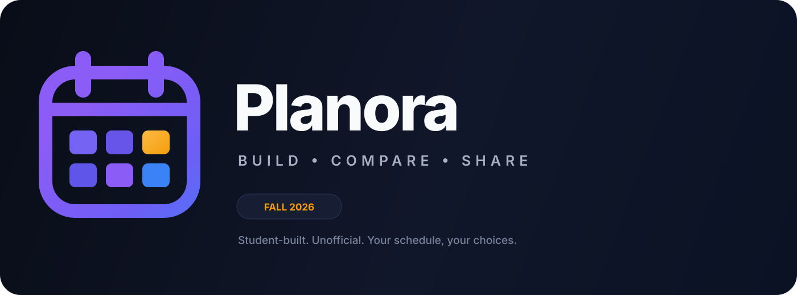
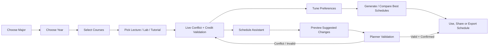
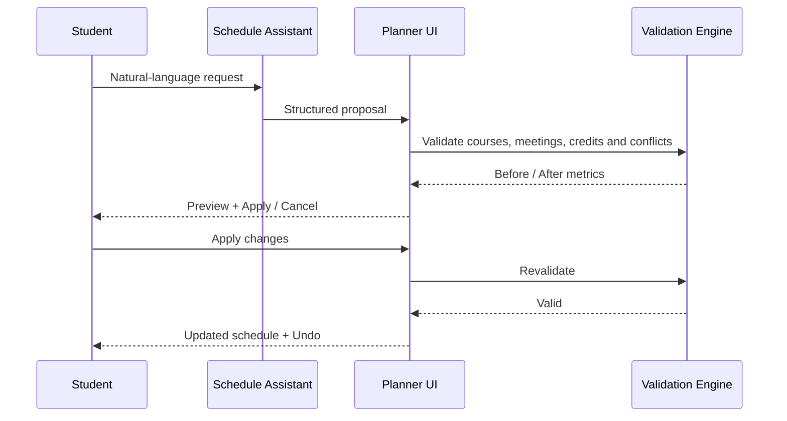
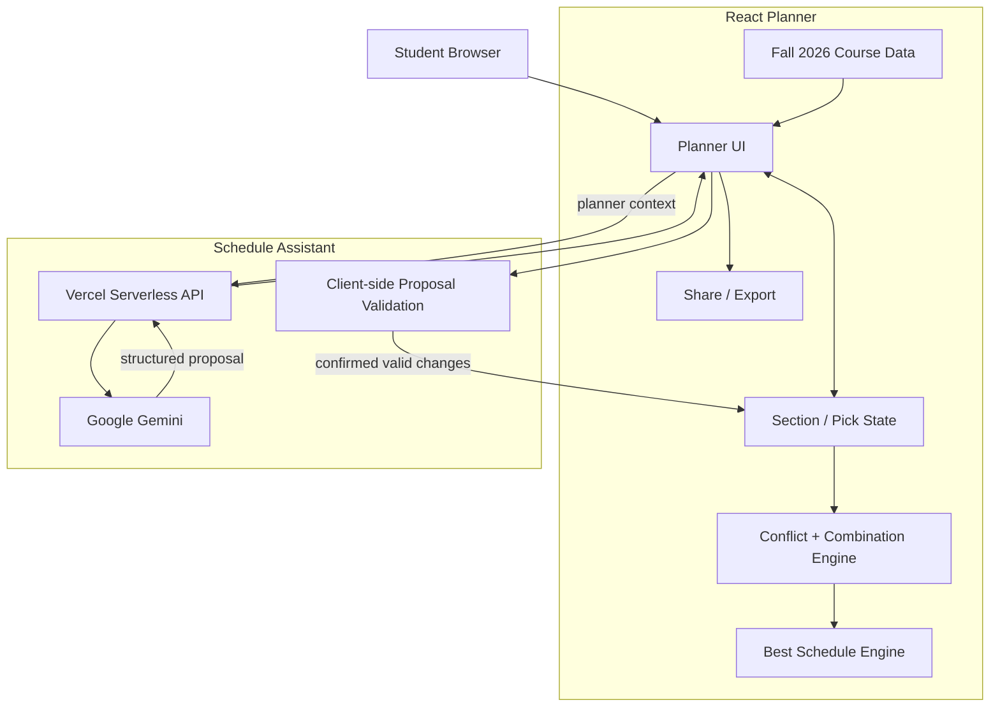

<p align="center">
  
</p>

<div align="center">

# Zewail City Fall 2026 Schedule Builder

**A student-built schedule planning tool for Zewail City — designed to make course selection, conflict checking, schedule optimization, and sharing easier before registration.**

<br/>

<a href="https://fall-2026-zewail-city.vercel.app/">
  
</a>

<br/><br/>


<br/><br/>

**Information Technology · Data Science & AI · Software Engineering**  
**Years 1–4 · Shared Requirements · Cross-Year Planning**

</div>

---

## Table of Contents

| | |
|---|---|
| [Overview](#overview) | [Schedule Assistant](#schedule-assistant) |
| [Key Features](#key-features) | [Architecture](#architecture) |
| [How It Works](#how-it-works) | [Technology Stack](#technology-stack) |
| [Supported Study Plans](#supported-study-plans) | [Project Structure](#project-structure) |
| [Best Schedule Engine](#best-schedule-engine) | [Local Development](#local-development) |
| [Conflict & Validation Rules](#conflict--validation-rules) | [Deployment](#deployment) |
| [Sharing & Persistence](#sharing--persistence) | [Data Accuracy](#data-accuracy--limitations) |
| [Testing](#testing) | [Contributing](#contributing) |
| [Privacy](#privacy) | [Disclaimer](#disclaimer) |

---

## Overview

The **Zewail City Fall 2026 Schedule Builder** is a web-based planner built to help students explore their Fall 2026 options before final registration.

Instead of manually comparing lecture, lab, and tutorial times across multiple courses, the planner keeps everything in one place and continuously evaluates the schedule as the student makes changes.

It can:

- show course options by **major and academic year**;
- combine lecture, lab, and tutorial sections across published instructor groups;
- detect real timetable conflicts;
- track credits and campus days;
- show free time and schedule gaps;
- generate and compare conflict-free schedules;
- preserve user preferences;
- share a schedule through a link or image;
- and provide an AI-assisted schedule workflow grounded in the planner's own course data.

> **Live application:** https://fall-2026-zewail-city.vercel.app/

> **Course data last verified:** **September 24, 2026**

---

## Key Features

<table>
<tr>
<td width="33%" valign="top">

### 🎓 Major & Year Planning
Browse the Fall 2026 plan by major and academic year, with support for Years 1–4.

</td>
<td width="33%" valign="top">

### 🔎 Course Search
Find courses quickly through the course search and the global command palette.

</td>
<td width="33%" valign="top">

### 🧩 Section Selection
Choose lecture, lab, and tutorial meetings independently from the published course data.

</td>
</tr>

<tr>
<td width="33%" valign="top">

### ⚠️ Conflict Detection
Time overlaps are evaluated using the actual start and end times of each meeting.

</td>
<td width="33%" valign="top">

### 👨‍🏫 Instructor Filtering
Filter visible options by instructor without locking the course to a single instructor group.

</td>
<td width="33%" valign="top">

### 🔄 Cross-Year Courses
Add courses from another year of the same major without losing the current study-plan context.

</td>
</tr>

<tr>
<td width="33%" valign="top">

### ✦ Best Schedule
Searches valid section combinations and ranks the strongest matches against the student's preferences.

</td>
<td width="33%" valign="top">

### ⚙️ Schedule Preferences
Prefer fewer campus days, smaller gaps, earlier finishes, later starts, free days, and time limits.

</td>
<td width="33%" valign="top">

### 🤖 Schedule Assistant
Ask questions in Arabic, English, Franco/Arabizi, or a mix — using the current planner as context.

</td>
</tr>

<tr>
<td width="33%" valign="top">

### ✅ Confirmable AI Changes
AI schedule changes are previewed and validated before the student can apply them.

</td>
<td width="33%" valign="top">

### 🔗 Shareable Schedules
Share planner state using a URL and export the current schedule as an image.

</td>
<td width="33%" valign="top">

### 📱 Responsive UI
Designed for both desktop and mobile use with large touch targets and responsive schedule views.

</td>
</tr>
</table>

---

## How It Works



The planner deliberately keeps **manual control** in the student's hands. Automated tools can suggest or generate schedules, but the student decides which schedule is actually used.

---

## Supported Study Plans

The planner currently includes Fall 2026 planning support for:

| Major | Years | Focus |
|---|---:|---|
| **Information Technology** | 1–4 | Networks, Security & Governance |
| **Data Science & AI** | 1–4 | Data Science and Artificial Intelligence |
| **Software** | 1–4 | Software Engineering |

Shared requirement courses such as SCH electives remain available across majors and years where configured in the planner.

The cross-year browser also allows students to add courses from another academic year of their **current major**.

---

## Best Schedule Engine

The Best Schedule feature does more than shuffle visible sections.

It builds valid course-level combinations from the published meeting data, then searches across those combinations while rejecting schedules that break real time constraints.

### Ranking signals

Depending on the student's preferences, the engine can favor schedules with:

- fewer campus days;
- smaller gaps;
- earlier finishing times;
- later starting times;
- selected preferred days;
- requested free days;
- preferred time windows;
- maximum hours per day.

Preferences can act as **soft ranking signals** or, where supported by the UI, **hard requirements**.

The search uses a bounded execution budget so extremely large combination spaces cannot freeze the browser.

---

## Conflict & Validation Rules

The planner works with real intervals rather than rough time-block labels.

Two meetings conflict when:

```text
startA < endB && startB < endA
```

That means back-to-back sessions are valid.

For example:

```text
12:00 PM – 2:00 PM
2:00 PM  – 4:00 PM
```

do **not** overlap.

The validation layer is also reused by AI proposals. Before an AI-generated change can be applied, the planner checks that:

1. the course exists for the selected major;
2. the proposed meeting ID exists in the current published planner data;
3. the requested lecture/lab/tutorial type matches a real meeting;
4. the proposal does not create a timetable conflict;
5. the proposal does not exceed the active credit limit.

The AI does not bypass the planner engine.

---

## Schedule Assistant

The **Schedule Assistant** is a Gemini-powered helper integrated directly into the planner.

It receives structured planner context such as:

- selected major and year;
- selected courses;
- current lecture/lab/tutorial meetings;
- published alternative sections;
- instructors;
- rooms and times;
- current conflicts;
- credit totals;
- campus days;
- gap time;
- schedule preferences.

### Natural-language interaction

Students can ask questions such as:

```text
Reduce my gaps
```

```text
خليني أروح 3 أيام بس
```

```text
مش عايز 8 الصبح
```

```text
Can I finish earlier without changing MATH 105?
```

The assistant supports **Arabic, English, Franco/Arabizi, and mixed-language conversations**.

### AI action flow



The assistant **cannot silently change the planner**. A schedule mutation requires an explicit student confirmation.

### Quick prompts

The current assistant includes shortcuts such as:

- **Reduce gaps**
- **Fewer campus days**
- **Finish earlier**
- **Avoid 8 AM**
- **Suggest another course**

### Security boundary

The Gemini API key is used only by the server-side Vercel function and is never included in the frontend bundle.

---

## Credit Planning

The planner supports the configured credit-cap choices:

- **13 credits**
- **18 credits**
- **21 credits / Over Load**

The general site ceiling is **21 credits**.

The UI also provides lightweight, non-blocking milestone reminders at **13, 17, 18, and 21 credits**. These are informational toasts only — they do not interrupt navigation or require dismissal before the student can continue using the planner.

No GPA value is requested or stored.

---

## Sharing & Persistence

The application keeps planner state locally and supports shareable schedule links.

A shared planner state can include information such as:

- major;
- academic year;
- selected courses;
- section picks;
- instructor filters;
- schedule preferences;
- display filters.

When a valid shared URL is opened, its state takes priority over stale local state so the recipient sees the intended schedule.

The planner also supports schedule-image export for easier sharing outside the app.

---

## Architecture



### Design principle

The architecture intentionally separates:

- **course data**;
- **deterministic scheduling logic**;
- **UI state**;
- **AI interpretation**.

The AI can interpret a student's request, but deterministic planner code remains responsible for deciding whether a proposed schedule change is actually valid.

---

## Technology Stack

| Layer | Technology |
|---|---|
| Frontend | React 19 |
| Language | TypeScript 5 |
| Build Tool | Vite 7 |
| Styling | Tailwind CSS 4 + custom CSS variables |
| Schedule Logic | Client-side TypeScript |
| AI | Google Gemini |
| AI API | Vercel Serverless Function |
| Deployment | Vercel |
| State Persistence | Browser Local Storage |
| Testing | Custom engine harness + SSR smoke tests + jsdom UI tests |

---

## Project Structure

The current production repository keeps the Vercel entry point short while the original planner source remains in its legacy nested project directory.

```text
Fall_2026_ZewailCity/
├── README.md
├── assets/
│   └── readme-banner.svg
│
├── app/
│   ├── api/
│   │   └── assistant.ts
│   ├── package.json
│   └── vercel.json
│
└── Final_Fall_2026_ZewailCity/
    └── Templates-Final-Final-main/
        └── Zewail-City-Templates-arena-01a09711-zewail-city-templates/
            └── Final_Fall_2026_ZewailCity/
                └── Final_Fall_2026_Zewail/
                    ├── src/
                    │   ├── components/
                    │   ├── data/
                    │   ├── lib/
                    │   ├── utils/
                    │   ├── App.tsx
                    │   ├── index.css
                    │   └── types.ts
                    ├── tests/
                    ├── package.json
                    └── vite.config.ts
```

> The nested source layout is a legacy repository structure. The production Vercel wrapper under `app/` exists to keep the deployed serverless API path short and reliable.

---

## Local Development

### Prerequisites

Use a Node.js version compatible with the current Vite toolchain:

```text
Node.js ^20.19.0 or >=22.12.0
```

### Clone the repository

```bash
git clone https://github.com/Ahmedamir21/Fall_2026_ZewailCity.git
cd Fall_2026_ZewailCity
```

### Open the planner package

```bash
cd "Final_Fall_2026_ZewailCity/Templates-Final-Final-main/Zewail-City-Templates-arena-01a09711-zewail-city-templates/Final_Fall_2026_ZewailCity/Final_Fall_2026_Zewail"
```

### Install and run

```bash
npm install
npm run dev
```

Vite will start the local frontend development server.

### Production build

```bash
npm run build
```

The production build is generated under:

```text
dist/
```

### Preview the production build

```bash
npm run preview
```

---

## Testing

The project includes multiple validation layers.

```bash
npm run test:harness
```

Core scheduling engine, combinations, conflict behavior, persistence, sharing, and preference checks.

```bash
npm run test:ssr
```

Full-app server-side rendering smoke test.

```bash
npm run test:ui
```

Real-DOM UI tests powered by jsdom.

A useful pre-deployment check is:

```bash
npm run test:harness
npm run test:ssr
npm run test:ui
npm run build
```

---

## Deployment

The live project is deployed on **Vercel**.

### Production wrapper

The Vercel project uses:

```text
Root Directory: app
```

The wrapper's build script:

1. installs dependencies in the nested planner package;
2. runs the planner's Vite production build;
3. copies the generated `dist/` into `app/dist`.

`app/vercel.json` also registers:

```text
api/assistant.ts
```

as the server-side Schedule Assistant endpoint.

### Required environment variable

The AI endpoint expects:

```text
GEMINI_API_KEY
```

This value belongs in Vercel Environment Variables and must never be committed to the repository or exposed in client code.

### Live deployment

**https://fall-2026-zewail-city.vercel.app/**

---

## Data Accuracy & Limitations

The planner uses a manually compiled Fall 2026 dataset.

It is **not connected to the university registration backend** and does not automatically receive Self-Service changes.

Therefore:

- instructor assignments can change;
- rooms can change;
- section times can change;
- courses can be added or removed;
- university registration rules can change independently of this project.

The repository records the current dataset verification date as:

> **2026-09-24**

The Best Schedule engine also uses a bounded search budget. In extremely large search spaces, it may return the strongest schedules found within that budget instead of exhaustively evaluating every theoretical combination.

**Always verify the final schedule in Zewail City Self-Service before registration.**

---

## Privacy

The application is intentionally lightweight.

The planner stores schedule-related state in the browser to restore the student's plan.

It does **not** ask for or intentionally store:

- student ID;
- university password;
- GPA value;
- Self-Service credentials.

Schedule Assistant requests include planner context required to answer the student's scheduling question. API credentials remain server-side.

---

## Contributing

Contributions that improve schedule accuracy, reliability, accessibility, mobile usability, or scheduling logic are welcome.

Before submitting a significant change:

1. keep course-data updates separate from unrelated UI changes where possible;
2. do not invent missing rooms, instructors, sections, or meeting times;
3. preserve the existing real-interval conflict rules;
4. run the relevant tests;
5. verify the production build.

For course-data corrections, include the source used to verify the updated section information in the pull request or commit context.

---

## Disclaimer

This is an **independent student-built project** created to help Zewail City students plan their Fall 2026 schedules.

It is **not an official Zewail City registration system**, is not operated by the university registration office, and cannot register courses or reserve seats.

Official registration decisions and final section details should always be confirmed through **Zewail City Self-Service**.

---

<div align="center">

### Ready to build your schedule?

<a href="https://fall-2026-zewail-city.vercel.app/">
  
</a>

<br/><br/>

<sub>Fall 2026 · Built for planning, not registration.</sub>

</div>
